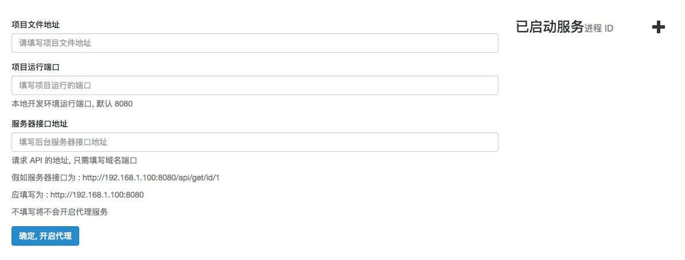
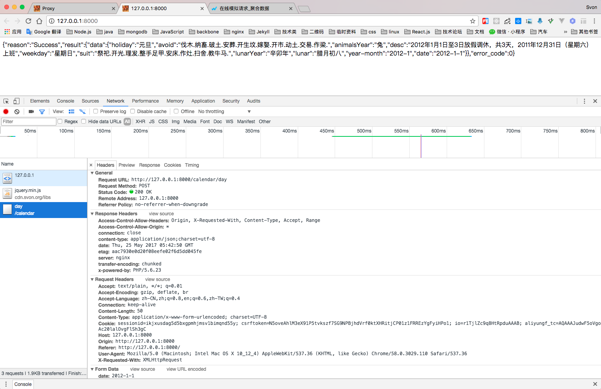
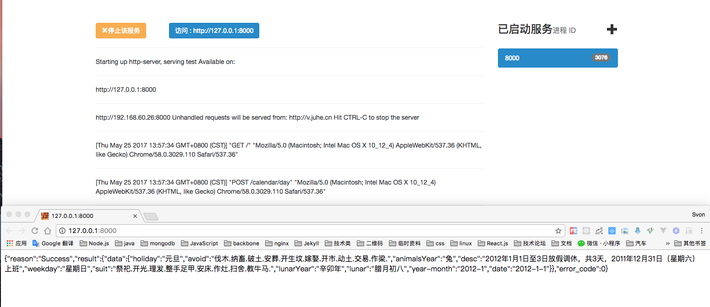

# proxy
简单的代理服务

    该项目运行在 Node.js 环境中，请提前安装好 Node.js 环境

### 下载项目

    git clone https://github.com/svonme/proxy.git

### 安装项目依赖

    cd proxy     //进入下载的项目目录

    npm install  //安装依赖模块

### 运行

    npm start    // 会自动后台运行一个 Express 环境 浏览器访问 http://127.0.0.1:3000

### 停止

    npm stop     // 关闭所有代理

### 重启

    npm restart 

### 例子

